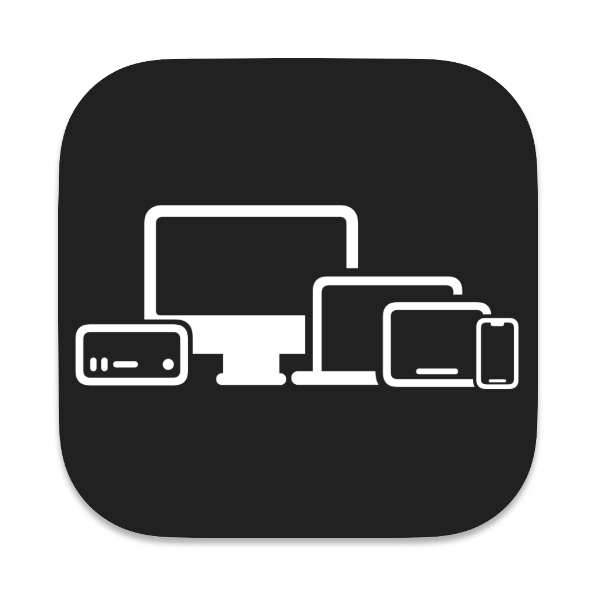

# DeviceHardware

<div align="center">
    
</div>

DeviceHardware is a package for getting iPhone, iPad and Mac model names and hardware information, such as SoC name.

Support for iOS devices and Macs by October 10, 2022 (JST).


## Usage

```swift
import DeviceHardware
```
### iOS

At first

```swift
let device = UIDeviceHardware.deviceHardware
```

Eample on iPhone 8 running iOS 14.2

```swift
device.modelName                  // iPhone 8
device.processorName              // Apple A11 Bionic
device.cpu                        // 2.39GHz 6-core
device.gpu                        // Apple A11 GPU
device.neuralEngine               // 2-core
device.modelIdentifier            // iPhone10,1
device.processorCount             // 6
device.ram                        // 2071019520
device.ramString                  // 1.93GB 
```

### macOS

At first

```swift
let device = MacDeviceHardware.deviceHardware
```

Eample on MacBook Pro (13-inch, 2018, Four Thunderbolt 3 ports) running macOS 11.0.1

```swift
device.modelName                  // MacBook Pro (13-inch, 2018, Four Thunderbolt 3 ports)
device.processorName              // Intel Core i5-8259U
device.cpu                        // 2.30GHz 4-core
device.gpu                        // Intel Iris Plus Graphics 655
device.neuralEngine               // None
device.modelIdentifier            // MacBookPro15,2
device.processorCount             // 8
device.ram                        // 17179869184
device.ramString                  // 16GB
```

Eample on MacBook Pro (13-inch, M1, 2020) running macOS 11.2.3

```swift
device.modelName                  // MacBook Pro (13-inch, M1, 2020)
device.processorName              // Apple M1
device.cpu                        // 3.2GHz 8-core
device.gpu                        // Apple M1
device.neuralEngine               // 16-core
device.modelIdentifier            // MacBookPro17,1
device.processorCount             // 8
device.ram                        // 17179869184
device.ramString                  // 16GB
```

### Mac models that cannot get the correct model name

You may not get the correct model name on some Macs. In the following models, you may not get the correct model name if the Mac have been customized to Intel Core i7.

- MacBook Air (13-inch, 2017)
- MacBook Air (13-inch, Early 2015)
- MacBook Air (13-inch, Early 2014)
- MacBook Air (13-inch, Mid 2013)
- MacBook Air (11-inch, Early 2014)
- MacBook Air (11-inch, Mid 2013)

## Requirements

This package is compatible with iOS 8 or higher and macOS 10.15 or higher. However, Mac device information can only be got for models that support macOS 11.

## Installation

### Swift Package Manager
Add this Swift package in Xcode using its GitHub repository URL. (File > Swift Packages > Add Package Dependency...)

## License
DeviceHardware is available under the MIT license. See the LICENSE file for more info.
